# Operation Crafter

**Operation Crafter** is a visual IDE for creating bootable 16-bit floppy disk operating systems using block-based coding - like Scratch, but for OS development!

# Features
- Visual block editor (mostly no assembly knowledge required)
- Traditional x86 assembly text editor for advanced users
- Built-in QEMU emulator for testing
- Built-in NASM compiler for building
- Plugin system for extending functionality

## Table of Contents
[Creating Workspace](#creating-workspace)\
[Opening Workspace](#opening-workspace)\
[Developing](#developing)\
[Blocks](#blocks)\
[Functions](#functions)\
[Plugins](#plugins)\
[Example Project](#example-project)\
[More Info](#more-info)\
[Run From Source](#run-from-source)\
[Linux](#linux)

# Creating Workspace

If this is not your first project and you want to open a project, go to 
[[Opening Workspace](#opening-workspace)]

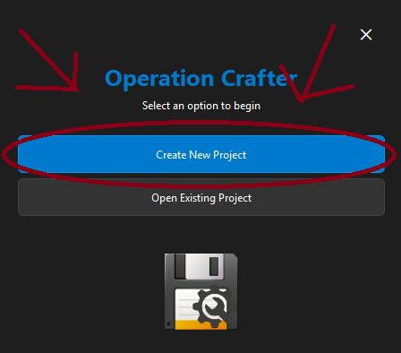

Then in the new menu that opens, name your project and give it a directory. You can select
a directory with the built-in button that opens an explorer window.
(It will create a folder inside this directory, so don't 
create a new directory for just this project.)

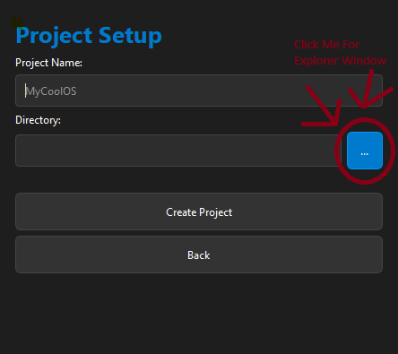

After, just press the Create Project button!

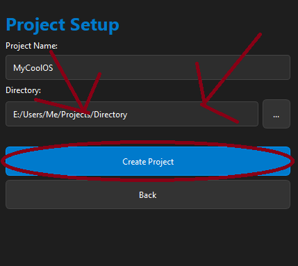

# Opening Workspace

If this is your first project or you want to create a new project, go to
[[Creating Workspace](#creating-workspace)]

Click the Open Project button. Then it will open an explorer window. Use this explorer
window to open the project's folder. (The project's folder is the one containing
the .projectdata file.)

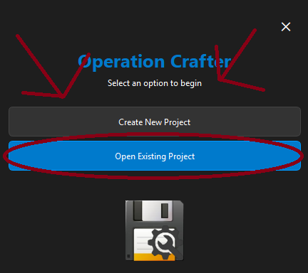

# Developing

If you need help creating a project, go to [[Creating Workspace](#creating-workspace)].\
If you need help opening a project, go to [[Opening Workspace](#opening-workspace)].

Open or create a workspace. 

Once in the IDE, you should have 3 files (ending in .asm) and 1 file (.projectdata). 
These are your project files.

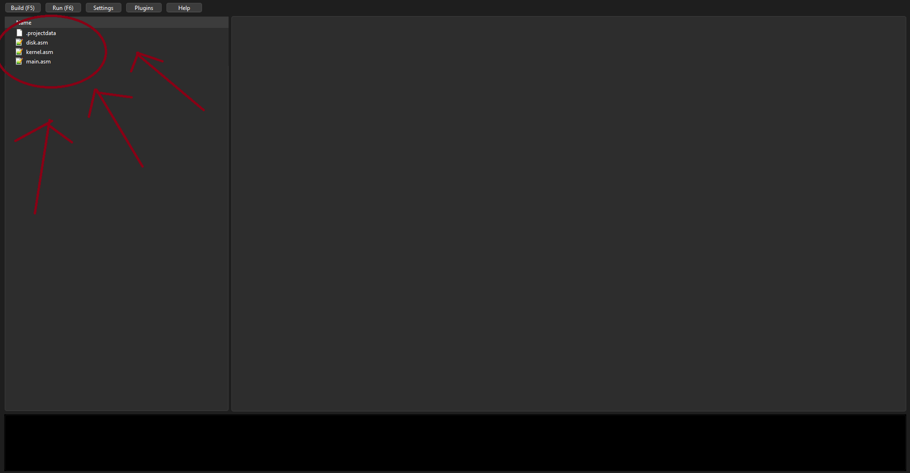

The .projectdata file is your project's data file. It stores 
info about your project like name and version.

By default, it is a template of a Hello World! project, but you can change it.

There are 2 ways of developing: coding in x86 assembly or coding in a custom
block-based coding system (like Scratch).

Double-click any file to open it in the tree view.\
You can right-click in the tree view to create files/folders, copy/paste, and more.

When a file is opened, you will have a text editor for you to code in if you want to
code in x86 Assembly.


You can right-click in the text editor space to copy/paste, find/replace, and more.

Alternatively, you can click the Visual Blocks button when a .asm file is open.

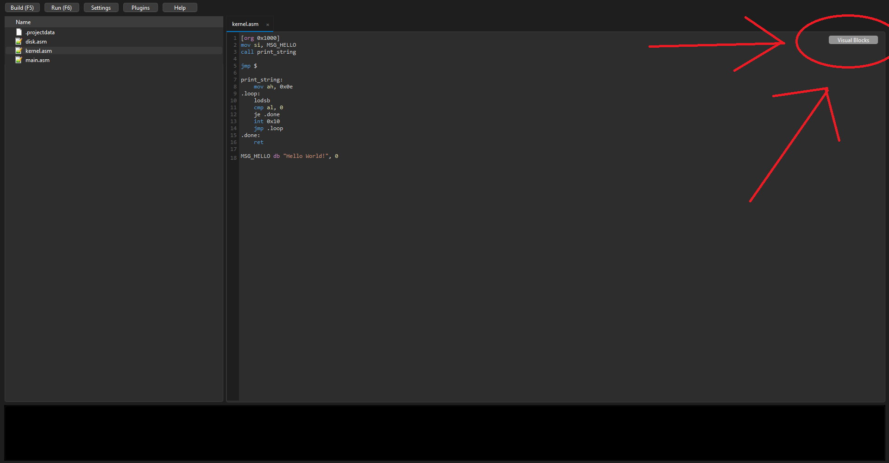

Pressing this will open a visual editor based on blocks like Scratch.

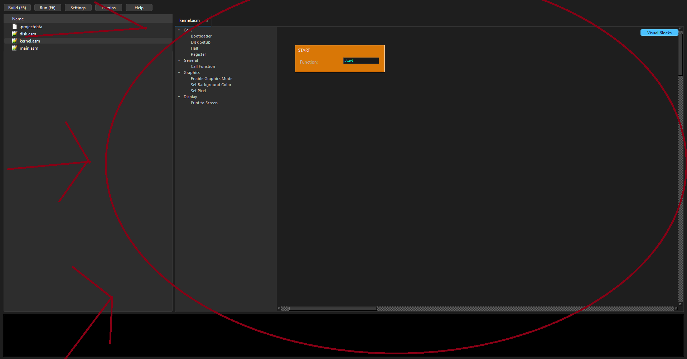

You can drag blocks from the sidebar onto the build area and connect them to other
blocks.

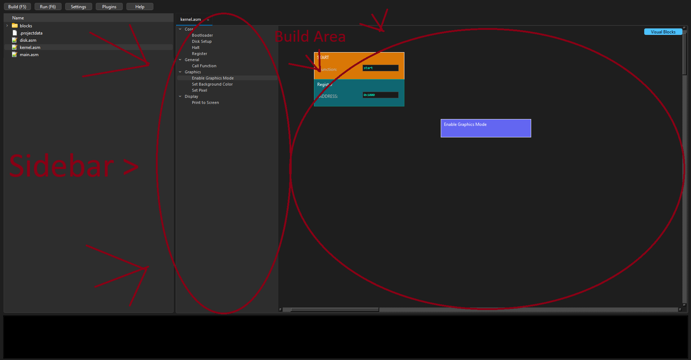

Blocks connected to the Start block will be coded. Blocks not connected will not be coded.

The blocks will change to a darker or lighter color when connected to
the start block.

To delete a block select it and press del.

In any input of a block (other then setting var blocks) do "%var[<varname>]" you can instead have it
use a var instead!

If the block has input "ID", then thats the ID of the block, every time you use that block in same file, change it
so dont have dupe ID's for codeblocks in 1 file.

To run QEMU, you first need to build. In the top corner, there's Build, Run, Settings, Plugins, and Help buttons.

Press Build to create a bootable image, then press Run to run the emulator.

The Settings button lets you change your project settings like version and name.

The Plugins button lets you install plugins and enable/disable plugins.

The Help button is a help button.

# Blocks

### Varables

AddVarInt: Increments a int var by a amount

SetVar (Text): Sets a var to a string

SetVar (Int): Sets a var to a int

StoreRegistrySlot: stores a var in a slot in the registry to allow vars to be global

LoadRegistrySlot: loads a var from a slot in the registry to allow vars to be global

### Logic

IntToString: Converts a int var into a string var

### Core

Bootloader: Handles the bootloader side (main.asm is your bootloader; this handles all the code other than the registry).

DiskSetup: Handles the disk setup (disk.asm is your disk by default; this does not need a registry).

End: Calls jmp $ or Ends the OS

Halt: Calls hlt command, halts the cpu

Register: Registers a file to an ADDRESS (bootloader and kernel require this at the start of code).

### General

CallFunction: Calls a function in a file (to use, go to [[Functions](#functions)]).

Wait: Pauses for some amount of time.

JMPToFunction: jmps to a function and ends rest of the code.

IfRandomCallFunction: if random is equal to a number, call function

### Graphics

ChangeColorPallet (Graphics): changes a color ID (0 - 15) to a RGB value (0 - 63)

EnableGraphicsMode: Enables graphics mode so you can use stuff in graphics.

DisableGraphicsMode: Disables graphics mode.

ClearScreen (Graphics): Clears all graphics off the screen.

SetScreenColor: Sets the screen's color (colors are 0 - 15).

SetPixel: Sets a pixel at xy to a color (colors are 0 - 15).

DrawRectangle: Sets a selection of pixels to a color (colors are 0 - 15).

PrintToScreen (Graphics): Prints text to the screen

DrawPicture: Draws a imported compiled picture file. (To import picures, right click tree
view and click import/convert .PNG (Raw Data) MAX 80x80)

### Display

ChangeColorPallet (Text): changes a color ID (0 - 15) to a RGB value (0 - 63)

PrintToScreen (Text): Prints text to the screen

ClearScreen (Text): Clears all text off the screen (does not work in graphics mode).

MoveCursor: Moves the text cursor to a point (where text will be placed).

HideCursor: Hides the cursor (the blinking line).

ShowCursor: Shows the cursor (the blinking line).

### Advanced

CustomCode: Lets you input custom code inside of the block editor.

### System
    
Reboot: Reboots the system.

Shutdown: Shuts down the system.

### Input

IfKeyCallFunction: Checks if key is pressed, if so call function, if not continue.

WaitForKeyPress: Pauses until a key is pressed.

WaitForSpecificKey: Pauses until a specific key is pressed.

### Sound

PlayBeep: Plays a beep sound.

PlaySound: Plays a sound file. (To import sounds, right click tree
view and click import/convert .OGG (Beeps). It will convert sound file to beep sounds.)

# Functions
To use functions, first create a new file and name it something, but it must be a .asm file.
If you need help with this, go to [[Developing](#developing)].

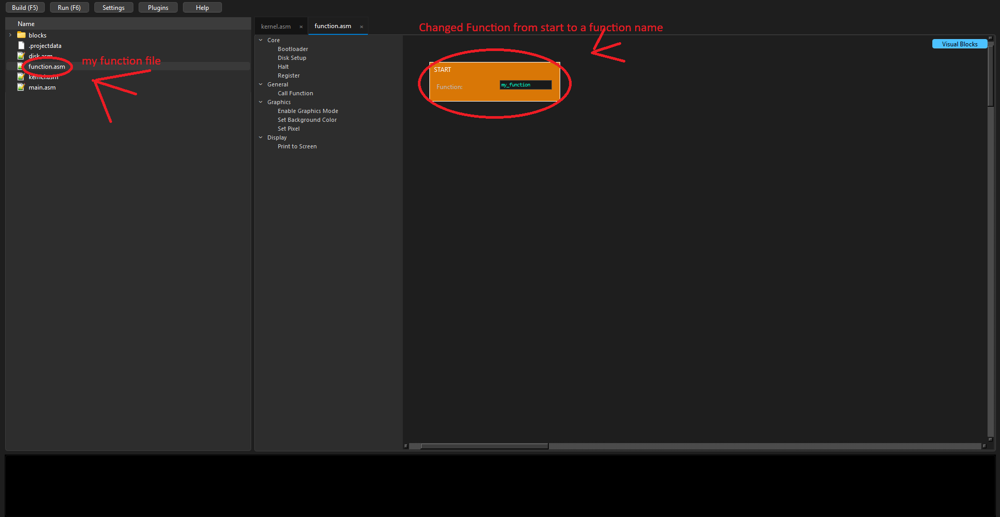

Then just code how you want here. You can call it from another file to run it.

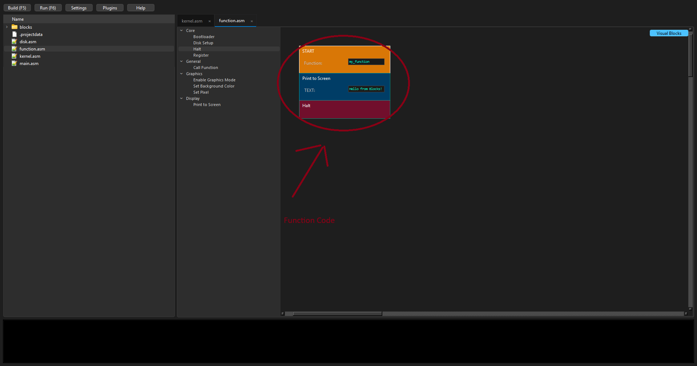

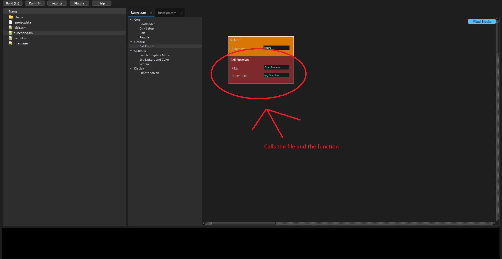

# Plugins
The IDE has plugin support!

You can download plugins (plugins are .zip files) and put them in the
plugins folder to install them, or click the Install Plugins button in the plugins
GUI to copy it to the plugins folder.

You can enable/disable plugins in the plugins GUI and hover on one to read the description.


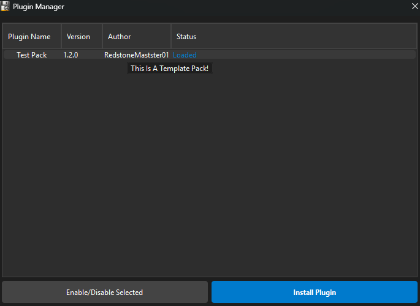

For developing plugins, check out the example plugin! It has everything
they can do right now.
You will need to know how to use x86 Assembly for code blocks.
[[TestPlugin.zip](git_readme/TemplatePlugins/TestPlugin.zip)]

# Example Project

Here's an example project to help you start out.

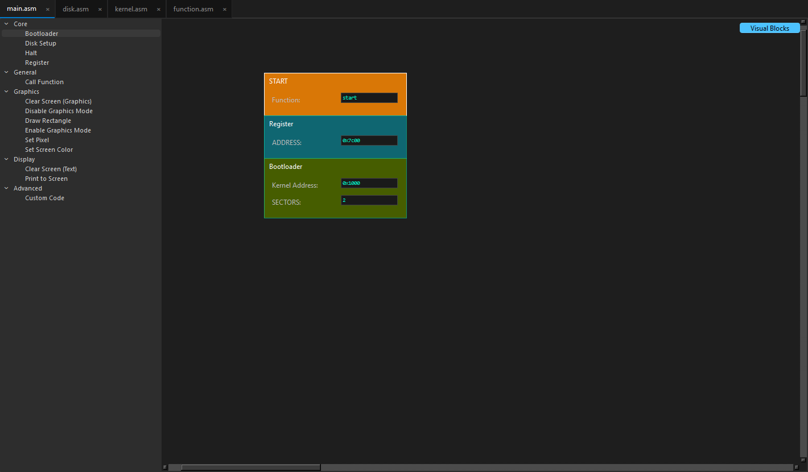
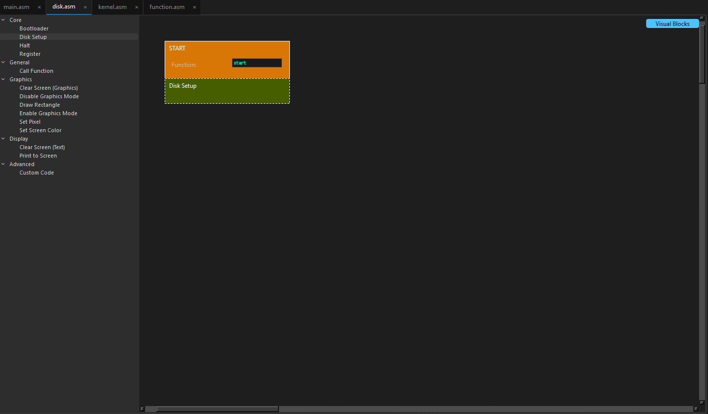
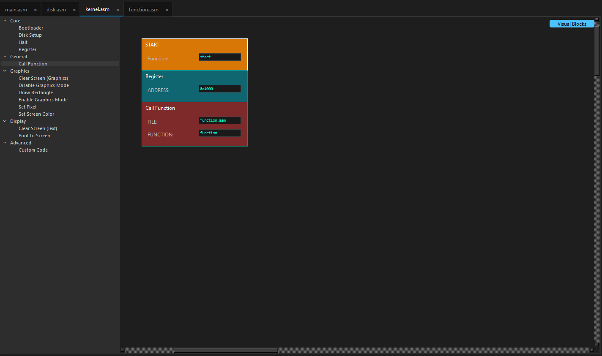
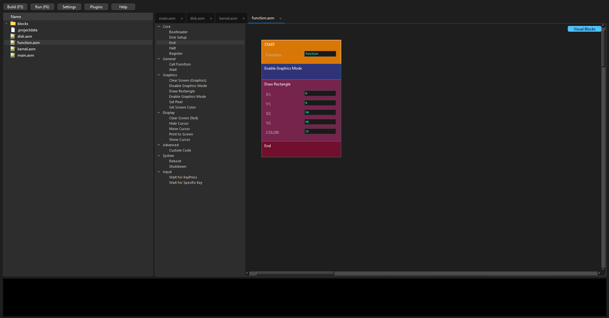

# More Info
This project contains NASM and QEMU. You must keep their licenses too for distributing
with them included.\
https://github.com/netwide-assembler/nasm \
https://www.qemu.org/

# Run From Source

Download the source code from the repository.

Download QEMU and NASM:
   - QEMU: https://qemu.weilnetz.de/w64/qemu-w64-setup-20251217.exe
   - NASM: https://www.nasm.us/pub/nasm/releasebuilds/3.01/win64/nasm-3.01-win64.zip

Install QEMU by running the installer, then navigate to where QEMU was installed and copy the QEMU folder to the project directory.

Extract the NASM zip file, rename the folder inside to `nasm`, and copy it to the project directory.

Install all required Python libraries:
   ```bash
   pip install -r requirements.txt
   ```

# Linux
(1.0 does not have linux support)


The release will have a already compiled app! yYou will have to make them a executable. Open 
terminal in the app's directory and run then it will run!

``` bash
chmod +x OperationCrafter qemu/qemu-system-x86_64 nasm/nasm

# or if the file name is OperationCrafter-Linux then do (v1.2 will be named this)
chmod +x OperationCrafter-Linux qemu/qemu-system-x86_64 nasm/nasm
``` 

### Run from source for linux

First do all the steps in [[Run From Source](#run-from-source)] other then the 
downloading QEMU and NASM part.

then in terminal, run
``` bash
sudo apt-get install qemu-system
sudo apt install nasm
```

then copy them from where they downloaded into them into their folders

``` bash
    # help coping them run these after install to copy them to desktop
    
cp /usr/bin/nasm ~/Desktop/
chmod +x ~/Desktop/nasm

cp /usr/bin/qemu-system-x86_64 ~/Desktop/
chmod +x ~/Desktop/qemu
```

then run the main.py file.
``` bash
python3 main.py
```